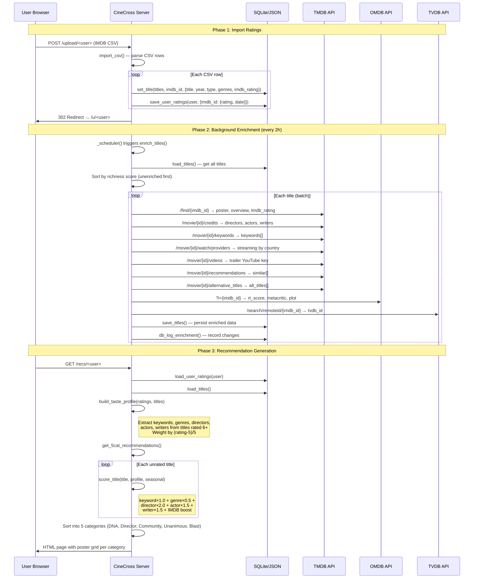
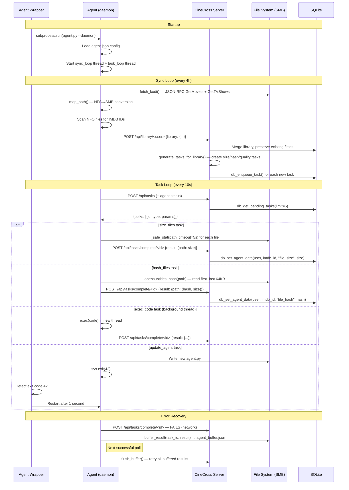
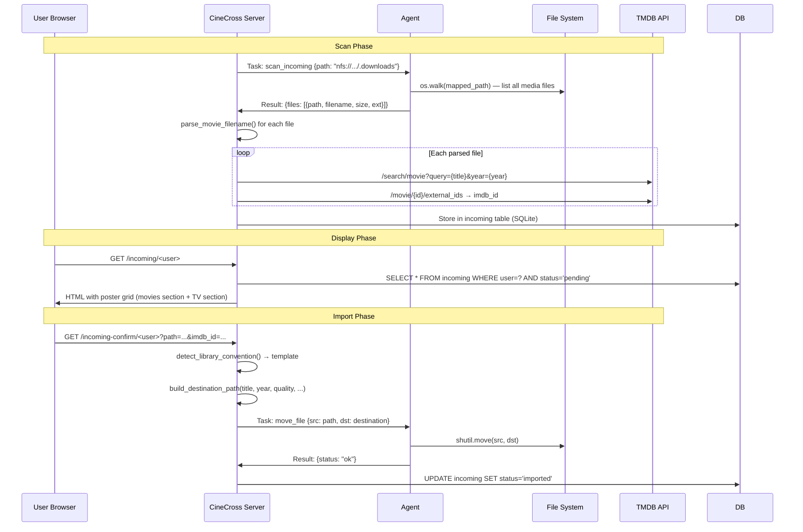
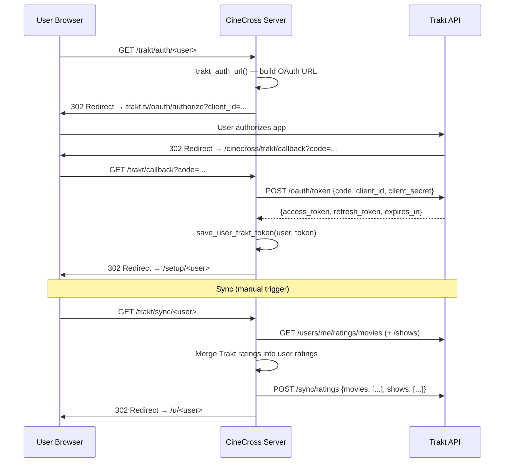

# CinephileCrossroads — Design Specification

Version: 2.1 | Generated: 2026-04-15 | Traces to: `requirements.md`

---

## 1. Architecture Overview

### 1.1 Physical File Structure → Component Mapping

```
CineCross/
├── app.py (4980 LOC)          # Server: HTTP handler, business logic, HTML rendering, DB, scheduler
│   ├── Lines 1–92             # Component: Configuration & Imports
│   ├── Lines 93–178           # Component: SQLite Database Layer
│   ├── Lines 179–215          # Component: JSON File I/O (legacy + atomic writes)
│   ├── Lines 217–300          # Component: UI Framework (nav_bar, page_head, page_foot, CSS)
│   ├── Lines 301–620          # Component: Task Queue & Job System
│   ├── Lines 621–690          # Component: API Helpers & User Data I/O
│   ├── Lines 691–890          # Component: External API Clients (TMDB, OMDB, TVDB)
│   ├── Lines 891–1134         # Component: Filename Parsing & Matching Engine
│   ├── Lines 1135–1330        # Component: Media Server Connectors (Plex/Jellyfin/Emby/Kodi/Radarr/Sonarr/TMM)
│   ├── Lines 1331–1500        # Component: Subtitle & Utility Functions
│   ├── Lines 1501–1650        # Component: IMDB Dataset & Trakt Integration
│   ├── Lines 1651–1860        # Component: Recommendation Engine (taste profile, scoring, 5 categories)
│   ├── Lines 1861–2160        # Component: Enrichment Pipeline & Streaming Catalog
│   ├── Lines 2161–2330        # Component: Import Handlers (CSV, Letterboxd, Streaming History)
│   ├── Lines 2331–2830        # Component: Page Renderers (Ratings, Recs, Setup, TV Shows)
│   ├── Lines 2831–3330        # Component: Library Pages (Dashboard, Browse, Scraper, Stats, Compare)
│   ├── Lines 3331–4535        # Component: HTTP Request Handler (do_GET dispatch — 60+ routes)
│   ├── Lines 4536–4810        # Component: HTTP POST Handler (15+ endpoints)
│   └── Lines 4811–4980        # Component: Scheduler, Migration, Server Bootstrap
│
├── agent.py (1284 LOC)        # LAN Agent: task execution, media server sync, file operations
│   ├── Lines 1–100            # Component: Buffer, Logging, HTTP Helpers
│   ├── Lines 101–400          # Component: Media Server Fetchers (Plex/Jellyfin/Kodi/Radarr/Sonarr/TMM)
│   ├── Lines 401–520          # Component: Path Mapping & Prerequisites
│   ├── Lines 519–670          # Component: Daemon Mode (sync loop + task loop)
│   ├── Lines 670–943          # Component: Task Execution Engine (13 task types)
│   └── Lines 944–1284         # Component: CLI, Subtitle Download, Hash Duplicates, Thumbnails
│
├── agent-wrapper.py (26 LOC)  # Supervisor: restart on crash/update
├── tests/
│   ├── conftest.py            # Shared fixtures (mock app module)
│   ├── test_parsing.py        # 37 tests: normalize, fuzzy match, filename parsing, source detection
│   ├── test_scoring.py        # 12 tests: scoring weights, taste profile, convention detection
│   ├── test_data_integrity.py # 11 tests: agent data separation, task queue, JSON safety, merge
│   └── test_api.py            # 14 tests: page loads, API endpoints, content verification
├── docker-compose.yml         # Container orchestration
├── Dockerfile                 # python:alpine + nfs-utils
└── README.md                  # User documentation
```

### 1.2 Data File Structure

```
/data/                              # Docker volume: imdb_imdb-data
├── cinecross.db                    # SQLite (WAL mode) — task_queue, agent_data, enrichment_log, incoming
├── titles.json                     # Shared metadata: {imdb_id: TitleRecord} — ~20K entries, ~2MB
├── catalog.json                    # Streaming catalog: {imdb_id: CatalogEntry}
├── catalog_prev.json               # Previous catalog snapshot (for "leaving soon" detection)
├── api_keys.json                   # API keys + config: {tmdb, omdb, tvdb, opensubs, llm_url, ...}
├── agent_status.json               # Agent heartbeat: {status, last_seen, version, tasks_completed}
├── thumbnails/                     # Video frame captures: <imdb_id>.jpg
├── imdb_datasets/                  # IMDB bulk data: title.basics.tsv, title.ratings.tsv
└── users/<username>/
    ├── ratings.json                # {imdb_id: {rating: int, date: str}}
    ├── tmm_library.json            # {imdb_id: LibraryEntry | [LibraryEntry]} — 18K+ entries
    ├── agent_data.json             # Legacy (migrated to SQLite agent_data table)
    ├── incoming.json               # Legacy (migrated to SQLite incoming table)
    ├── trakt_token.json            # {access_token, refresh_token, expires_in, created_at}
    ├── providers.json              # {provider_name: bool}
    ├── watchlist.json              # [imdb_id, ...]
    ├── history.json                # [{imdb_id, title, watched_at, type}]
    └── media_config.json           # {server_type: {enabled, url, token}}
```

---

## 2. Type Definitions

### 2.1 Core Data Structures

```python
# TitleRecord — shared metadata in titles.json
TitleRecord = {
    "title": str,                    # Primary title
    "originalTitle": str,            # Original language title
    "year": str,                     # Release year "2024"
    "type": str,                     # "movie" | "tvSeries" | "tvMiniSeries" | "short" | "tvMovie"
    "genres": str,                   # Comma-separated: "Drama, Thriller"
    "imdb_rating": str,              # "7.8"
    "imdb_votes": str,               # "125000"
    "runtime": str,                  # "148"
    "poster": str,                   # TMDB poster URL
    "overview": str,                 # Plot summary
    "tmdb_id": int,                  # TMDB numeric ID
    "tmdb_rating": float,            # 0.0–10.0
    "tmdb_votes": int,               # Vote count
    "rt_score": str,                 # "92%" Rotten Tomatoes
    "metacritic": str,               # "85" Metacritic score
    "keywords": [str],               # ["heist", "revenge", "neo-noir"]
    "directors": [str],              # ["Christopher Nolan"]
    "actors": [str],                 # ["Leonardo DiCaprio", "Tom Hardy"]
    "writers": [str],                # ["Christopher Nolan"]
    "trailer": str,                  # YouTube video key "dQw4w9WgXcQ"
    "similar": [str],                # [imdb_id, ...] from TMDB recommendations
    "alt_titles": [str],             # ["Le Prestige", "Das Prestige", ...]
    "providers": {str: [str]},       # {"LU": ["Netflix", "Disney Plus"]}
    "tastedive": [str],              # Similar titles from TasteDive
    "tvdb_id": int,                  # TVDB numeric ID
    "awards": str,                   # Awards text from OMDB
    "enriched": str,                 # ISO timestamp of last enrichment
    "catalog_providers": [str],      # Providers from catalog fetch
}

# UserRating — per-user in ratings.json
UserRating = {
    "rating": int,                   # 1–10
    "date": str,                     # "2024-03-15" or ISO datetime
}

# LibraryEntry — per-user in tmm_library.json
LibraryEntry = {
    "path": str,                     # NFS or local path to video file
    "year": str,                     # Year from media server
    "playcount": int,                # Times watched (from Kodi)
    "lastplayed": str,               # ISO datetime
    "runtime": int,                  # Minutes
    "streamdetails": {               # From Kodi
        "video": [{"codec": str, "width": int, "height": int}],
        "audio": [{"codec": str, "channels": int, "language": str}],
        "subtitle": [{"language": str}]
    },
    # Agent-enriched fields (now in SQLite agent_data table):
    "file_size": int,                # Bytes
    "file_hash": str,                # OpenSubtitles hash (hex)
    "thumbnail": str,                # "/thumbnails/tt1234567.jpg"
    "confirmed": bool,               # User confirmed filename match
    "nfo_matched": str,              # IMDB ID from NFO file
}
# When duplicate paths exist for same IMDB ID, value is [LibraryEntry, LibraryEntry]

# EpisodeData — stored under tmm_library["_episodes"]
EpisodeData = {
    "showtitle": str,                # "Breaking Bad"
    "season": int,                   # 1
    "episode": int,                  # 3
    "file": str,                     # File path
    "playcount": int,                # Times watched
    "runtime": int,                  # Minutes
    "streamdetails": {...},          # Same as LibraryEntry
}
```

### 2.2 SQLite Schemas

```sql
-- task_queue: Agent task management (REQ-AGT-002)
CREATE TABLE task_queue (
    id TEXT PRIMARY KEY,             -- "task_1713180000000_42"
    type TEXT,                       -- "size_files" | "hash_files" | "check_quality" | "download_subs"
                                     --   | "find_duplicates" | "exec_code" | "update_agent"
                                     --   | "scan_incoming" | "move_file" | "delete_file"
                                     --   | "generate_thumb" | "diag" | "batch"
    params TEXT DEFAULT '{}',        -- JSON: task-specific parameters
    priority INTEGER DEFAULT 0,      -- -1=human, 0=high, 1=medium, 2=low
    status TEXT DEFAULT 'pending',   -- "pending" | "done"
    created TEXT,                    -- ISO datetime
    completed TEXT,                  -- ISO datetime (when done)
    result TEXT                      -- JSON: task result data
);

-- agent_data: Per-file metadata from agent (REQ-LIB-001, REQ-AGT-003/004)
CREATE TABLE agent_data (
    user TEXT,                       -- Username
    imdb_id TEXT,                    -- IMDB ID
    field TEXT,                      -- "file_size" | "file_hash" | "thumbnail" | "confirmed" | "nfo_matched"
    value TEXT,                      -- Field value (string; file_size converted to int at merge time)
    PRIMARY KEY (user, imdb_id, field)
);

-- enrichment_log: Change tracking (REQ-ENR-005)
CREATE TABLE enrichment_log (
    id INTEGER PRIMARY KEY AUTOINCREMENT,
    imdb_id TEXT,                    -- IMDB ID
    title TEXT,                      -- Title at time of change
    year TEXT,                       -- Year
    ts TEXT,                         -- ISO datetime
    changes TEXT                     -- JSON: {"field_name": "new_value", ...}
);

-- incoming: Incoming folder scan results (REQ-LIB-008)
CREATE TABLE incoming (
    id INTEGER PRIMARY KEY AUTOINCREMENT,
    user TEXT,                       -- Username
    path TEXT UNIQUE,                -- Full NFS path
    filename TEXT,                   -- Basename
    size INTEGER,                    -- Bytes
    title_guess TEXT,                -- Parsed title
    year_guess TEXT,                 -- Parsed year
    quality TEXT,                    -- "1080p" | "2160p" | etc.
    tmdb_match TEXT,                 -- JSON: TMDB match data
    status TEXT DEFAULT 'pending',   -- "pending" | "imported" | "deleted"
    destination TEXT                 -- Target path after import
);
```

### 2.3 API Contracts

```python
# GET /api — Server info
Response = {"status": "ok", "titles": int, "users": [str]}

# GET /api/tasks — Agent polls for work (REQ-AGT-002)
# Agent also POSTs status in body
Request_Body = {"status": str, "version": str, "tasks_completed": int}  # optional
Response = {"tasks": [TaskRecord]}
TaskRecord = {"id": str, "type": str, "params": dict, "priority": int, "status": str}

# POST /api/tasks/complete/<task_id> — Agent reports result (REQ-AGT-002)
Request = {"result": dict}  # task-type-specific result
Response = {"status": "ok"}

# POST /api/library/<user> — Agent pushes library (REQ-MED-009)
Headers = {"X-Agent-Token": str}
Request = {"library": {imdb_id: LibraryEntry}}
Response = {"status": "ok", "count": int, "tasks_generated": int, "new_items": int}

# POST /api/agent_status — Agent heartbeat
Request = {"status": str, "version": str, "last_seen": str}
Response = {"status": "ok"}

# GET /api/agent_status — Server reads agent status
Response = AgentStatus  # from agent_status.json

# GET /api/exec_results — Get exec_code results
Response = {task_id: {"result": dict, "completed": str}}

# POST /api/thumbnail/<user> — Agent uploads thumbnail (REQ-AGT-013)
Request = {"imdb_id": str, "thumbnail": str}  # base64-encoded JPEG
Response = {"status": "ok"}

# POST /upload/<user> — IMDB CSV upload (REQ-RAT-001)
Content-Type: multipart/form-data; field "csv"
Response: 302 redirect to /u/<user>

# POST /tmm/<user> — TMM library upload
Content-Type: multipart/form-data; field "tmm"
Response: 302 redirect to /u/<user>

# POST /letterboxd/<user> — Letterboxd CSV upload (REQ-RAT-002)
Content-Type: multipart/form-data; field "csv"
Response: 302 redirect to /u/<user>

# POST /keys — Save API keys (SEC-003)
Content-Type: application/x-www-form-urlencoded
Params: tmdb, omdb, tvdb, opensubs, opensubs_user, opensubs_pass, agent_token,
        incoming_path, sub_language, audio_language, llm_url, llm_token
Response: 302 redirect to /

# POST /providers/<user> — Save streaming providers
Params: prov[] (multi-value)
Response: 302 redirect to /setup/<user>

# POST /media/<user> — Save media server config
Params: type, url, token
Response: 302 redirect to /setup/<user>

# GET /rss/<user> — RSS feed (REQ-EXP-002)
Content-Type: application/rss+xml
Response: RSS 2.0 XML

# GET /export/<user> — CSV export (REQ-EXP-001)
Content-Type: text/csv
Response: CSV with headers imdb_id,title,year,rating,date,genres

# GET /api/updates?user=<user>&offset=<n> — Enrichment log (lazy loading)
Response = [{"imdb_id": str, "title": str, "year": str, "ts": str, "changes": dict}]
```

### 2.4 Task Parameter & Result Schemas

```python
# size_files
Params = {"user": str, "imdb_ids": [str], "paths": [str]}
Result = {"path1": int, "path2": int}  # path → file size in bytes

# hash_files
Params = {"user": str, "imdb_ids": [str], "paths": [str]}
Result = {"path1": {"hash": str, "size": int}}

# check_quality
Params = {"user": str, "paths": [str]}
Result = {"path1": {"exists": bool, "size": int}}

# find_duplicates
Params = {"user": str, "paths": [str]}
Result = {"path1": {"exists": bool, "size": int}}

# download_subs
Params = {"user": str, "imdb_id": str, "path": str, "language": str, "file_hash": str, "file_size": int}
Result = {"status": "ok" | "not_found" | "error", "language": str, "filename": str}

# exec_code
Params = {"code": str}
Result = dict  # arbitrary, defined by the code

# update_agent
Params = {"code": str}  # new agent.py source
Result = {"status": "updated"}  # then exit(42)

# scan_incoming
Params = {"path": str}
Result = {"files": [{"path": str, "filename": str, "size": int, "ext": str}]}

# move_file
Params = {"src": str, "dst": str}
Result = {"status": "ok" | "error", "message": str}

# delete_file
Params = {"path": str}
Result = {"status": "ok" | "error"}

# generate_thumb
Params = {"imdb_id": str, "path": str, "user": str}
Result = {"status": "ok", "thumbnail": str}  # base64 JPEG

# diag
Params = {}
Result = {"os": str, "python": str, "mappings": dict, "paths": dict, "version": str, "agent_path": str}
```

---

## 3. Sequence Diagrams

### 3.1 Primary Data Flow: Rating Import → Enrichment → Recommendation



### 3.2 Agent Task Lifecycle



### 3.3 Incoming File Import Flow



### 3.4 Trakt OAuth Flow




---

## 4. Component Details

### 4.1 HTTP Route Map (176 functions, 60+ GET routes, 15+ POST routes)

#### GET Routes → Handler Functions

| Route Pattern | Handler | Requirement |
|---|---|---|
| `/` | Redirect to `/u/<first_user>` | — |
| `/u/<user>` | `render_ratings(user)` | REQ-RAT-004 |
| `/recs/<user>` | `render_recs(user)` | REQ-REC-002 |
| `/setup/<user>` | `render_setup(user)` | — |
| `/library/<user>` | `render_library(user)` | REQ-LIB-001 |
| `/library/browse/<user>` | inline in do_GET | REQ-LIB-002 |
| `/library/org/<user>` | inline in do_GET | REQ-LIB-005 |
| `/tvshows/<user>` | `render_tvshows(user)` | REQ-LIB-003 |
| `/scraper/<user>` | `render_scraper(user)` | REQ-LIB-004 |
| `/scraper-match/<user>` | inline TMDB search | REQ-LIB-004 |
| `/scraper-apply/<user>` | inline apply match | REQ-LIB-004 |
| `/confirm/<user>` | `find_mismatches(user)` | REQ-LIB-006 |
| `/confirm-ok/<user>` | inline confirm | REQ-LIB-006 |
| `/incoming/<user>` | inline in do_GET | REQ-LIB-008 |
| `/incoming-delete/<user>` | inline delete | REQ-LIB-008 |
| `/incoming-confirm/<user>` | inline import | REQ-LIB-008 |
| `/title/<imdb_id>` | inline in do_GET | REQ-TIT-001 |
| `/similar/<imdb_id>` | `tastedive_similar()` | REQ-TIT-001 |
| `/rate/<user>/<imdb_id>/<rating>` | inline in do_GET | REQ-RAT-005 |
| `/stats/<user>` | `render_stats(user)` | — |
| `/unrated/<user>` | inline in do_GET | REQ-RAT-008 |
| `/history/<user>` | inline in do_GET | REQ-RAT-007 |
| `/mood/<user>/<mood>` | `mood_filter()` | REQ-RAT-006 |
| `/tonight/<user>` | inline in do_GET | REQ-REC-008 |
| `/random/<user>` | inline in do_GET | REQ-REC-009 |
| `/catalog` | `render_catalog()` | REQ-CAT-002 |
| `/catalog/fetch` | `fetch_streaming_catalog()` | REQ-CAT-001 |
| `/new` | `render_new_on_streaming()` | REQ-CAT-003 |
| `/feed` | `get_activity_feed()` | REQ-SOC-001 |
| `/compare/<u1>/<u2>` | `render_compare(u1, u2)` | REQ-SOC-002 |
| `/alerts/<user>` | `get_available_alerts()` | REQ-CAT-005 |
| `/contribute/<user>` | inline in do_GET | REQ-CON-001 |
| `/contribute/pull/<user>/<src>` | inline pull | REQ-CON-002 |
| `/ai-friend/<user>` | inline in do_GET | REQ-REC-006 |
| `/ai-chat/<user>` | `llm_ask()` | REQ-REC-007 |
| `/free-movies` | `search_internet_archive()` | REQ-PUB-001 |
| `/watchlist/add/<user>/<imdb_id>` | inline | REQ-SOC-003 |
| `/watchlist/rm/<user>/<imdb_id>` | inline | REQ-SOC-003 |
| `/export/<user>` | inline CSV | REQ-EXP-001 |
| `/rss/<user>` | inline RSS XML | REQ-EXP-002 |
| `/subs/<user>` | inline subtitle search | REQ-SUB-001 |
| `/subs/request/<user>/<imdb_id>` | `request_file_hash()` | REQ-SUB-001 |
| `/subs/auto/<user>` | `_bg_auto_subs()` | REQ-SUB-003 |
| `/subs/dl/<file_id>` | `opensubs_download_link()` | REQ-SUB-002 |
| `/trakt/auth/<user>` | `trakt_auth_url()` | REQ-TRK-001 |
| `/trakt/callback` | `trakt_exchange_code()` | REQ-TRK-002 |
| `/trakt/sync/<user>` | `trakt_fetch_ratings()` + `trakt_sync_push()` | REQ-TRK-003/004 |
| `/profile/<user>` | inline taste profile | — |
| `/datasets/download` | `download_imdb_datasets()` | REQ-ENR-007 |
| `/enrich` | `enrich_titles()` | REQ-ENR-004 |
| `/media/sync/<user>` | `sync_media_servers()` | REQ-MED-001–008 |
| `/import/streaming/<user>` | inline form | REQ-RAT-003 |
| `/updates` | inline enrichment log page | REQ-ENR-005 |
| `/jobs` | inline job status | — |
| `/thumbnails/<filename>` | static file serve | REQ-LIB-007 |
| `/api` | JSON server info | — |
| `/api/tasks` | `get_pending_tasks()` | REQ-AGT-002 |
| `/api/tasks/complete/<id>` | `complete_task()` | REQ-AGT-002 |
| `/api/agent_status` | `load_agent_status()` | — |
| `/api/exec_results` | `_exec_results` dict | — |
| `/api/updates` | enrichment log JSON | REQ-ENR-005 |

#### POST Routes → Handler

| Route Pattern | Handler | Requirement |
|---|---|---|
| `/upload/<user>` | `import_csv()` | REQ-RAT-001 |
| `/tmm/<user>` | TMM library import | REQ-MED-007 |
| `/letterboxd/<user>` | `import_letterboxd()` | REQ-RAT-002 |
| `/media/<user>` | Save media server config | REQ-MED-001–008 |
| `/providers/<user>` | Save streaming providers | REQ-REC-003 |
| `/keys` | Save API keys | SEC-003 |
| `/import/streaming/<user>/<svc>` | `import_streaming_history()` | REQ-RAT-003 |
| `/api/library/<user>` | Agent library push | REQ-MED-009 |
| `/api/tasks` | Agent task poll (POST) | REQ-AGT-002 |
| `/api/tasks/complete/<id>` | Agent result report | REQ-AGT-002 |
| `/api/agent_status` | Agent heartbeat | — |
| `/api/thumbnail/<user>` | Agent thumbnail upload | REQ-AGT-013 |

### 4.2 Recommendation Engine (REQ-REC-001 → REQ-REC-011)

```
build_taste_profile(ratings, titles, user)
├── For each title rated 6+:
│   ├── weight = (rating - 5) / 5.0  (range: 0.2 to 1.0)
│   ├── keywords[kw] += weight × 1.0
│   ├── genres[g] += weight × 0.5
│   ├── directors[d] += weight × 2.0
│   ├── actors[a] += weight × 1.5
│   └── writers[w] += weight × 1.5
├── For fully-watched unrated TV shows:
│   └── Treat as implicit rating 7 (weight = 0.4)
└── Returns: {keywords: {}, genres: {}, directors: {}, actors: {}, writers: {}}

score_title(title, profile, seasonal)
├── keyword_score = sum(profile.keywords[kw] for kw in title.keywords if kw in profile)
├── genre_score = sum(profile.genres[g] for g in title.genres if g in profile)
├── director_score = sum(profile.directors[d] for d in title.directors if d in profile)
├── actor_score = sum(profile.actors[a] for a in title.actors if a in profile)
├── writer_score = sum(profile.writers[w] for w in title.writers if w in profile)
├── raw = keyword + genre + director + actor + writer + seasonal_boost
├── imdb_boost = float(imdb_rating) / 10.0 if imdb_rating else 0.5
└── Returns: raw × imdb_boost

get_5cat_recommendations(user, titles, n_per_cat=10)
├── DNA Match: top score_title() results
├── Director's Chair: titles by user's top-rated directors
├── Community: TMDB "similar" titles from user's top-rated
├── Unanimous Hits: high IMDB + high TMDB + high taste score
└── Blast from the Past: year < (current - 20) + high taste score
```

### 4.3 Filename Parsing Engine (REQ-LIB-004, REQ-LIB-006)

```
parse_movie_filename(filename)
├── Strip extension
├── TV detection: match [. _-](?:S\d{1,2}E\d{1,2}|\d{1,2}x\d{2,3})
│   ├── If TV: extract show_name, season, episode
│   └── Return {is_tv, title, season, episode, quality, ...}
├── Extract quality: 2160p|4K|1080p|720p|480p
├── Extract 3D: 3D|SBS|OU|Half-SBS
├── Extract year: (19|20)\d{2}
├── Clean title: replace dots/underscores with spaces
└── Return {title, year, quality, is_3d, filename}

_normalize(s)
├── unicodedata.normalize("NFD") — strip accents
├── German transliterations: ä→ae, ö→oe, ü→ue, ß→ss
├── / → space, & → and, - → space
├── Strip standalone numbers (bitrate remnants)
└── Lowercase, collapse whitespace

_fuzzy_match(a, b)
├── Normalize both strings
├── Split into word sets
├── overlap = len(words_a & words_b)
├── ratio = overlap / max(len(words_a), len(words_b))
└── Return ratio (0.0–1.0)

find_mismatches(user, threshold=0.6)
├── For each library entry:
│   ├── Extract filename from path
│   ├── _normalize(filename)
│   ├── Check against: title, originalTitle, alt_titles[]
│   ├── Use _fuzzy_match() with threshold
│   ├── Also try substring matching for alt_titles
│   └── If no match above threshold → mismatch
└── Return [(imdb_id, title, filename, best_score)]
```

---

## 5. Technical Debt & Known Issues

| ID | Location | Description | Severity |
|----|----------|-------------|----------|
| TD-001 | `app.py` L3331–4535 | **Monolithic do_GET**: 1200-line if/elif chain dispatching 60+ routes. Should use route registry (`_routes` list exists but unused). | High |
| TD-002 | `app.py` throughout | **Inline HTML generation**: All pages built via string concatenation. No template engine. ~2000 lines of `html +=` statements. | High |
| TD-003 | `app.py` L4536–4780 | **Duplicate POST handlers**: `/api/tasks/complete/`, `/api/agent_status`, `/api/library/` each appear 2–3 times in `_do_POST` due to incremental additions. | Medium |
| TD-004 | `app.py` throughout | **XSS incomplete**: `esc()` helper exists (L89) but not applied to most user-facing output (titles, filenames, paths rendered raw). | High |
| TD-005 | `app.py` L2331–2830 | **Inline CSS**: Most pages use inline `style=` attributes instead of CSS classes. ~500 inline style occurrences. | Low |
| TD-006 | `app.py` L645–660 | **titles.json still JSON**: Largest data file (~2MB, 20K entries) not yet migrated to SQLite. Loaded entirely into memory on every request. | High |
| TD-007 | `app.py` L301–304 | **Legacy JSON functions**: `load_task_queue()`, `save_task_queue()` still exist but are no longer called (SQLite replaced them). Dead code. | Low |
| TD-008 | `app.py` L706–712 | **Legacy agent_data JSON**: `load_agent_data()`, `save_agent_data()` still exist for fallback but SQLite is primary. | Low |
| TD-009 | `agent.py` L131–220 | **Kodi JSON-RPC complexity**: 90 lines of nested JSON-RPC calls with manual pagination. No abstraction layer. | Medium |
| TD-010 | `app.py` SEC-002 | **No authentication**: Any user on the network can access any user's data by URL. Acceptable for LAN but blocks public deployment. | High |
| TD-011 | `app.py` SEC-006 | **No path traversal validation**: Username from URL used directly in `user_dir()` path construction. `../` in username could escape data directory. | High |
| TD-012 | `app.py` SEC-007 | **No upload size limit**: Multipart form parsing reads entire body into memory. Large uploads could OOM the server. | Medium |
| TD-013 | `app.py` L73 | **Bare except blocks**: 15+ instances of `except: pass` that swallow all exceptions silently. | Medium |
| TD-014 | `app.py` L4536–4780 | **No CSRF protection**: POST endpoints accept requests from any origin (CORS: `*`). | Medium |
| TD-015 | `agent.py` L793 | **exec_code security**: Executes arbitrary Python code received from server. No sandboxing. | High (by design) |
| TD-016 | `app.py` L57–75 | **LLM error handling**: `llm_ask()` returns empty string on any error. No retry, no user feedback on failure cause. | Low |
| TD-017 | `app.py` L2014–2075 | **Catalog fetch pagination**: Fetches up to 20 pages from TMDB discover API sequentially. Could be parallelized. | Low |
| TD-018 | `app.py` L1930–2013 | **Enrichment single-threaded**: Processes titles sequentially. With 20K titles and 3 API calls each, full enrichment takes hours. | Medium |
| TD-019 | `app.py` L3658 | **Regex warning fixed**: `\d` in JS string was causing SyntaxWarning. Fixed to `\\d`. | Resolved |
| TD-020 | `app.py` L45–48 | **Route decorator unused**: `@route` decorator and `_routes` list defined but the do_GET dispatch still uses if/elif. | Low |

---

## 6. Requirement → Design Traceability Matrix

| Requirement | Design Component | Functions | Data Stores |
|---|---|---|---|
| REQ-RAT-001 | Import Handlers | `import_csv()` | titles.json, ratings.json |
| REQ-RAT-002 | Import Handlers | `import_letterboxd()` | titles.json, ratings.json |
| REQ-RAT-003 | Import Handlers | `import_streaming_history()` | history.json |
| REQ-RAT-004 | Page Renderers | `render_ratings()` | titles.json, ratings.json |
| REQ-RAT-005 | HTTP GET Handler | inline `/rate/` | ratings.json |
| REQ-RAT-006 | Utility Functions | `mood_filter()` | titles.json |
| REQ-REC-001 | Recommendation Engine | `build_taste_profile()` | titles.json, ratings.json, tmm_library.json |
| REQ-REC-002 | Recommendation Engine | `get_5cat_recommendations()`, `_pool()` | titles.json |
| REQ-REC-003 | Recommendation Engine | `get_streaming_recs()` | providers.json, catalog.json |
| REQ-REC-006 | Page Renderers | inline `/ai-friend/` | titles.json, ratings.json, tmm_library.json |
| REQ-REC-007 | LLM Integration | `llm_ask()` | api_keys.json |
| REQ-ENR-001 | External API Clients | `tmdb_enrich()` | titles.json |
| REQ-ENR-002 | External API Clients | `omdb_enrich()` | titles.json |
| REQ-ENR-004 | Scheduler | `_scheduler()`, `enrich_titles()` | titles.json, enrichment_log (SQLite) |
| REQ-ENR-006 | Scheduler | `_scheduler()` alt titles block | titles.json |
| REQ-LIB-001 | Library Pages | `render_library()` | tmm_library.json, agent_data (SQLite), task_queue (SQLite) |
| REQ-LIB-006 | Matching Engine | `find_mismatches()`, `_normalize()`, `_fuzzy_match()` | tmm_library.json, titles.json |
| REQ-LIB-008 | Incoming Handler | inline `/incoming/` | incoming (SQLite) |
| REQ-MED-004 | Media Server Connectors | `fetch_kodi_library()` (server), `fetch_kodi()` (agent) | tmm_library.json |
| REQ-AGT-001 | Agent Daemon | `daemon_mode()`, `sync_loop()`, `task_loop()` | agent.json, agent_buffer.json |
| REQ-AGT-009 | Agent Task Engine | `run_task("update_agent")` | agent.py (self) |
| REQ-AGT-015 | Agent Buffer | `buffer_result()`, `flush_buffer()` | agent_buffer.json |
| REQ-TRK-001 | Trakt Integration | `trakt_auth_url()` | — |
| REQ-TRK-003 | Trakt Integration | `trakt_fetch_ratings()` | ratings.json |
| REQ-TRK-004 | Trakt Integration | `trakt_sync_push()` | — |
| REQ-PUB-001 | Public Domain | `search_internet_archive()` | — |
| REQ-SUB-001 | Subtitle Functions | `opensubs_search()` | api_keys.json |
